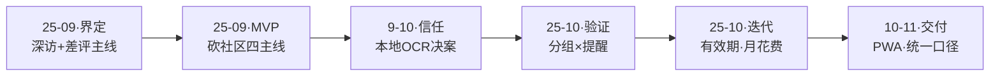
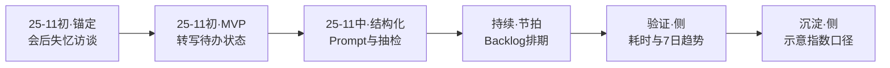
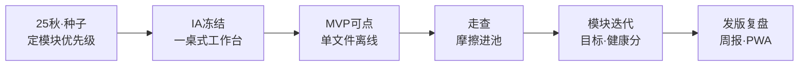
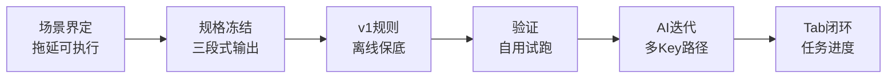
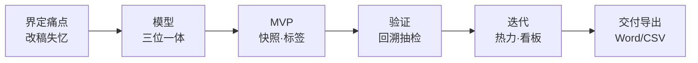
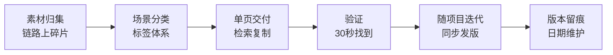

# 流程图 · Mermaid 源码

> **时间线锚点**：活动运营实习 **2024.08–2025.08**；**宠伴** **2025.09 起**、**会议舱** **2025.11 起**。对外展示以 `demo/work` 各页 **dev-flow** 与迭代文档为准；本文件便于仓库内对照与导出到 Figma / 墨刀。  
> **导出**：粘贴到 [mermaid.live](https://mermaid.live) → **SVG/PNG** → 拖入 **Figma** / **墨刀**（详见 `../README.md`）。

---

## 宠伴（主案例）

**维护备注（仓库内）**：与 PDF 简历「宠伴」小节可对照，勿将本说明贴入作品集 HTML。

---

## 会议舱（主案例）

**维护备注（仓库内）**：与 PDF 简历「会议舱」小节可对照。

---

## 创作舱（补充）

**维护备注（仓库内）**：与 PDF「补充项目 · 创作舱」一句话可对照。

---

## 冷启动（补充）

**维护备注（仓库内）**：与 PDF「规则保底 + AI 增强」一句可对照。

---

## 剧本舱（补充）

**维护备注（仓库内）**：与 PDF「热力图、标签、导出与回溯」可对照。

---

## Prompt 库（协作向）

**维护备注（仓库内）**：与 PDF「Prompt / PRD→原型协作」表述可对照。
